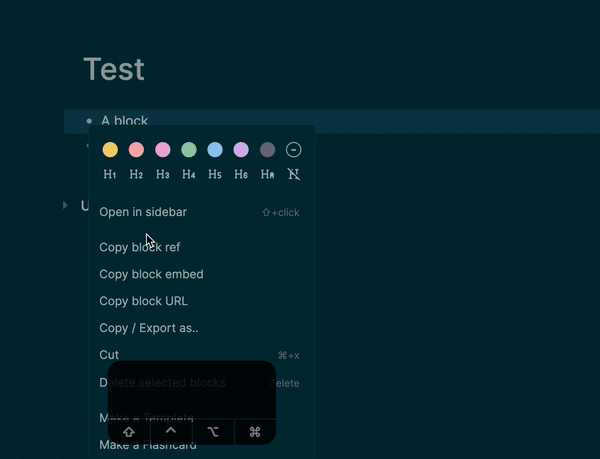
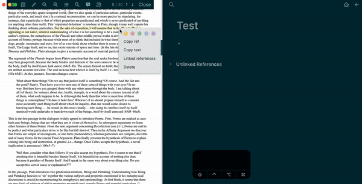

# Block Pin

Add "Paste as pin" shortcut to pdf and editer blocks.

## Showcase

After copy a block ref, press `Ctrl + P` (`Cmd + P` if macOS) in editor to paste block as pin.

You can copy block ref in PDF reader as well.

## Settings

You can change shortcut in `Settings - Keymap`. Just search `paste block as pin`.

You can change pin label in `Settings - Plugins`. Default is "📌".
